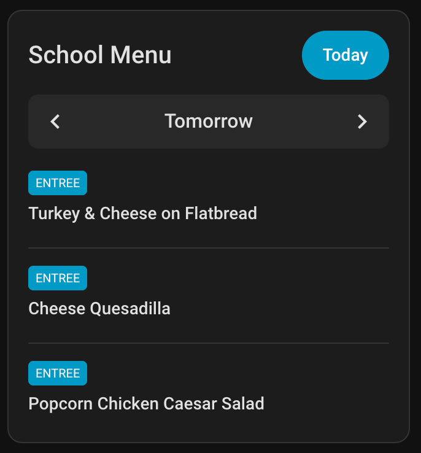
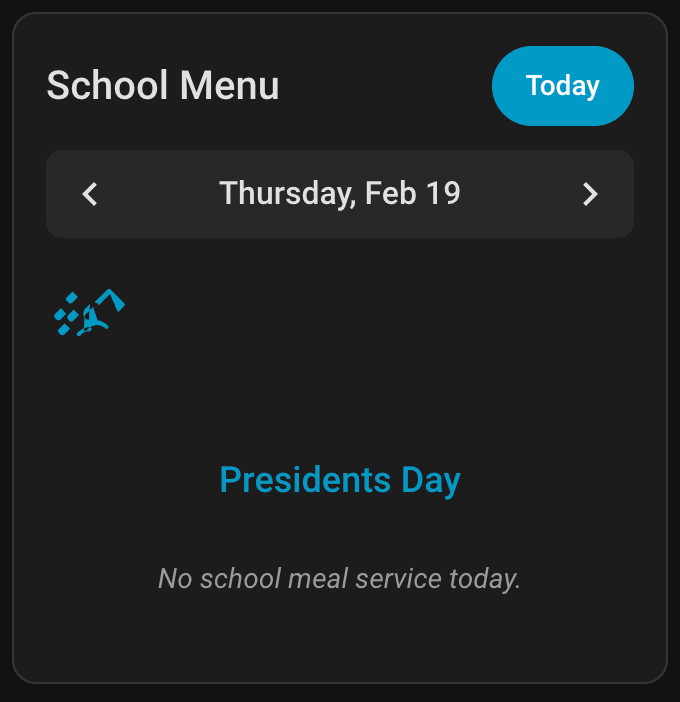

# Nutrislice Card

A Home Assistant Lovelace card to display school lunch menus from the [Nutrislice Home Assistant Integration](https://github.com/jbiral/nutrislice-ha).




## Installation

This card is best installed via [HACS](https://hacs.xyz/).

1. Open HACS in Home Assistant.
2. Go to **Frontend**.
3. Click the three dots in the top right and select **Custom repositories**.
4. Add the URL of this repository and select **Lovelace** as the category.
5. Search for "Nutrislice Card" and install it.

## Configuration

Add the following to your dashboard:

### Basic Example
```yaml
type: custom:nutrislice-card
entity: sensor.nutrislice_menu_your_school
```

### Advanced Example
```yaml
type: custom:nutrislice-card
entity: sensor.nutrislice_menu_your_school
title: 'Elementary School Menu'
categories:
  - entree
  - sides
```

## Options

| Name | Type | Requirement | Default | Description |
| :--- | :--- | :--- | :--- | :--- |
| type | string | **Required** | | `custom:nutrislice-card` |
| entity | string | **Required** | | The entity ID of the Nutrislice sensor (e.g., `sensor.nutrislice_menu_xxx`). |
| title | string | Optional | `School Menu` | The title displayed at the top of the card. |
| categories | list | Optional | `['entree']` | A list of categories to display. Supported values depend on your school, but common ones include `entree`, `sides`, `vegetable`, `fruit`. |

## Features

- **Date Navigation**: Use the arrows to browse menus for different days.
- **Auto-Advance**: The card automatically shows tomorrow's menu after 1 PM.
- **Holiday Awareness**: Displays special formatting for holidays and schools breaks.
- **Responsive**: Adapts to Home Assistant's dark and light themes.

